# MARION-IA-USA PDU Manager

The **MARION-IA-USA PDU Manager** is an internal operations application used to view and safely control rack Power Distribution Unit (PDU) outlets in the MARION-IA-USA server environment.

The production service currently runs on **VM154 on Proxmox host `MIAM-00133`** and is accessed at:

`https://10.0.20.154/`

This repository is intended to become the authoritative source for the application code, requirements, deployment automation, architecture, and operational documentation.

> **Current migration state:** the production VM predates this repository. The live service must be captured and verified against the repository before GitHub can be considered the complete production source of truth. See `docs/CURRENT_STATE_AND_LIMITATIONS.md`.

## Why this service exists

The server environment contains equipment whose power is controlled through network-managed PDUs. Directly managing each PDU is slower, easier to mis-document, and increases the chance of a dangerous power operation.

The PDU Manager exists to provide one understandable control surface that:

- presents human-readable asset/outlet names instead of raw outlet numbers;
- centralizes multiple PDUs;
- shows current outlet state;
- supports deliberate ON/OFF/REBOOT actions;
- supports batch operations and operational presets;
- protects critical assets from accidental shutdown/reboot;
- records actions for troubleshooting and accountability;
- supports configuration backup/restore workflows;
- can be operated from a normal browser, including mobile use;
- can be maintained reproducibly from Git rather than by editing production files in place.

## Known environment

The following environment facts are known and must be verified as part of the source-capture/reproducibility work:

| Component | Known role |
|---|---|
| `MIAM-00133` | Proxmox host that runs the production PDU Manager VM |
| VM154 | Production PDU Manager guest |
| `10.0.20.154` | PDU Manager HTTPS endpoint |
| `10.0.20.151` | Network-managed PDU endpoint |
| `10.0.20.152` | Network-managed PDU endpoint |
| `10.0.20.153` | Network-managed PDU endpoint; networking-related rack loads are visible here |
| `10.0.20.101` | LLDAP service used in this environment; exact PDU Manager integration must be verified |

Current KVM-related asset naming that must not regress:

- `MIAM-00172 - JetKVM Hardware Console`
- `MIAM-00182 - TESmart 16-Port HDMI KVM`

## Safety model

Power control is inherently consequential. Development and CI validation must be designed so that a test failure cannot unexpectedly power off infrastructure.

**Never use real outlet actuation as an automated smoke test.**

Production power commands require deliberate user action and must respect protection/lockout rules. Critical power targets must be protected from casual OFF/REBOOT actions.

## Project sources of truth

| File | Purpose |
|---|---|
| `REQUIREMENTS.md` | Approved capabilities and acceptance criteria |
| `FUTURE_WORK.md` | Deferred/unapproved ideas that must not be silently implemented |
| `SPRINT.md` | Current execution plan |
| `docs/ARCHITECTURE.md` | Architecture and deployment intent |
| `docs/OPERATIONS.md` | How humans and agents operate/troubleshoot the service |
| `docs/DEPLOYMENT.md` | Current and target deployment model |
| `docs/CURRENT_STATE_AND_LIMITATIONS.md` | What is verified today, what is unknown, and known limitations |
| `docs/adr/` | Significant architecture decisions |
| `docs/tdr/` | Accepted/in-progress technical debt |
| `AGENTS.md` | AI-agent operating rules and production safety guardrails |

## Current workflow

```mermaid
flowchart LR
    A[Future idea] -->|human approves scope| B[REQUIREMENTS.md]
    B --> C[SPRINT.md]
    C --> D[Agent implementation]
    D --> E[Validation and tests]
    E --> F[Pull request]
    F --> G[Human review]
    G -->|approved| H[Merge]
    H --> I[Staging deployment]
    I --> J[Production approval]
    J --> K[VM154 deployment]
```

Human review remains the control point. Agents may implement and validate approved work and prepare PRs, but must not merge their own work under the current operating model.

## Implementation-state labels used in this repository

Documentation should clearly distinguish:

- **Implemented and verified** - directly observed in live code/runtime or demonstrated in tests.
- **Implemented but not fully validated** - present, but not safely exercised against production hardware.
- **Required target** - approved behavior that the code/deployment must satisfy.
- **Future work** - not approved implementation scope merely because it is documented.
- **Unknown / verify** - evidence is incomplete.
