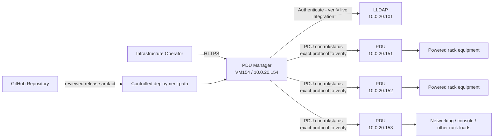
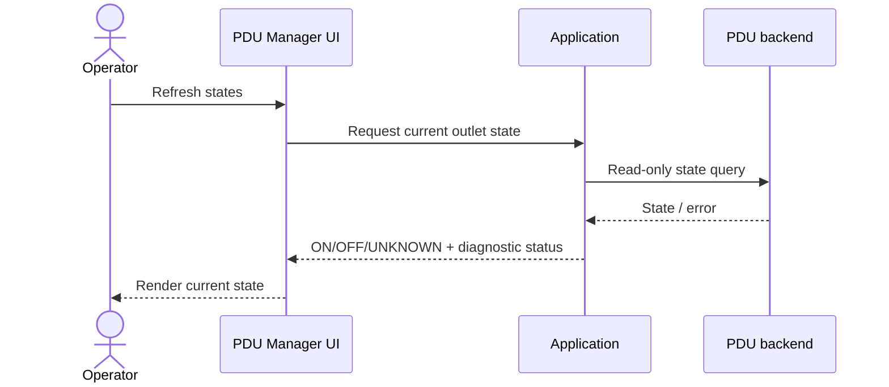
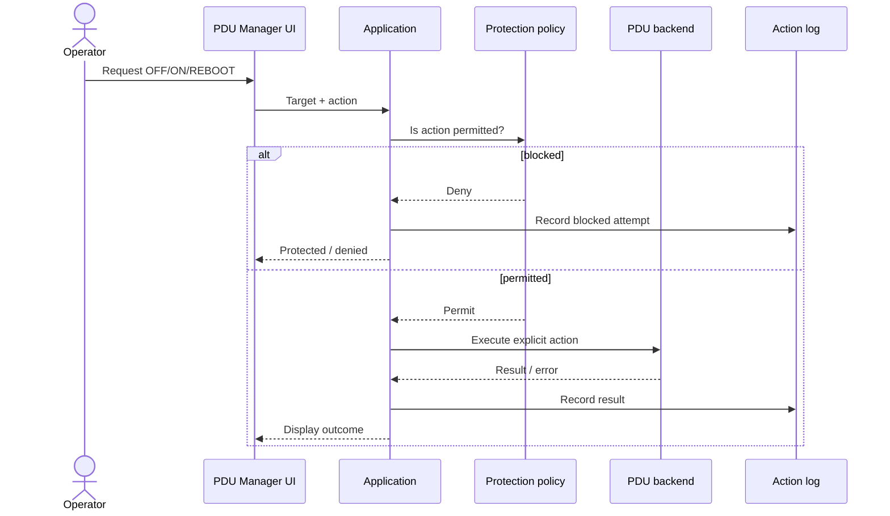
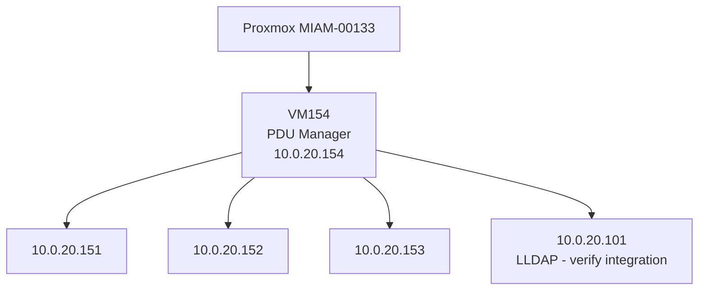

# Architecture

This is the single lean architecture document for the MARION-IA-USA PDU Manager. It follows the arc42 section structure and uses Mermaid for diagrams.

Implementation details that have not yet been captured from VM154 are explicitly marked **Unknown / verify**. Do not fill those gaps with guesses.

## 1. Introduction and Goals

### Purpose

The PDU Manager provides a centralized internal web interface for monitoring and deliberately controlling power outlets on network-managed PDUs in the MARION-IA-USA server environment.

The service reduces the operational risk of interacting with raw PDU interfaces and provides human-readable mapping, protection, logging, and a recoverable software change path.

### Requirements Overview

Architecturally significant requirements include:

- `REQ-008` - protect critical outlets;
- `REQ-010` - automated validation must not actuate production hardware;
- `REQ-011` / `REQ-012` - authenticated access and externalized secrets;
- `REQ-015` - code deployment must preserve mutable site configuration;
- `REQ-018` - production HTTPS;
- `REQ-019` - GitHub becomes authoritative application source after parity validation;
- `REQ-020` - clean-environment reproducibility;
- `REQ-022` / `REQ-023` - controlled production deployment and rollback.

See `../REQUIREMENTS.md` for the complete requirement set.

### Quality Goals

1. **Safety:** automated testing/deployment cannot unexpectedly change electrical power state.
2. **Recoverability:** VM154 can be recreated from source, deployment automation, externalized secrets, and backed-up mutable configuration.
3. **Traceability:** production releases map to reviewed Git commits/artifacts.
4. **Operability:** operators can understand device identity, state, action result, and protection status from the browser UI.
5. **Maintainability:** another human/AI agent can continue work from repository-local documentation and code.

### Stakeholders

| Stakeholder / Role | Primary Concern |
|---|---|
| Infrastructure operator | Correct device identity, safe power actions, clear status, rapid recovery |
| Startup Teams engineering | Reproducible source, reviewable changes, tests, maintainable code |
| AI coding/ops agents | Explicit guardrails, discoverable commands, no hidden production state |
| System owner | Avoid accidental outages and preserve operational continuity |

## 2. Architecture Constraints

- Production currently runs on VM154 hosted by `MIAM-00133`.
- Production UI is currently reached at `https://10.0.20.154/`.
- Managed PDU endpoints exist on the private `10.0.20.x` management network, including `10.0.20.151`, `.152`, and `.153`.
- Automated CI/deployment validation must not use real outlet actuation.
- Secrets must not be committed to Git.
- Human approval is required before merge under the current repository governance model.
- Production deployment should restart application services rather than rebooting VM154 when a service restart is sufficient.
- The current runtime stack must be captured before selecting a new deployment technology.

## 3. Context and Scope

### Business Context / C4 System Context

### Technical Context

Known interfaces:

| Interface | Direction | Purpose | Status |
|---|---|---|---|
| HTTPS | Operator -> VM154 | Browser UI | Known current deployment |
| PDU management protocol | VM154 -> PDUs | Read state and execute approved power actions | **Unknown / verify exact implementation**; UI has described a direct SSH/PowerAlert backend |
| LDAP/LLDAP | VM154 -> `10.0.20.101` | Authentication | Known environment dependency; **verify exact live implementation** |
| GitHub | Engineering/CI -> repository | Source/change management | Target source of truth |
| Deployment runner | CI/CD -> VM154 | Controlled software release | Target, not yet implemented |

Trust boundary: production PDU credentials and directory credentials must remain outside the repository and should be accessible only to the identities that require them.

## 4. Solution Strategy

### Current strategy

The PDU Manager runs as a single internal web application on VM154 and communicates with the managed PDUs over the management network.

The exact application framework, reverse proxy, process manager, data format, and service unit are **Unknown / verify from live VM154** during source capture.

### Target strategy

- Capture the live service without rewriting it.
- Establish GitHub as the authoritative source after parity validation.
- Separate immutable application code from secrets and mutable site configuration.
- Test PDU behavior through mocks/non-actuating adapters.
- Reproduce the service on a clean staging VM.
- Build immutable release artifacts in CI.
- Deploy the exact staging-tested artifact to VM154 only after human approval.
- Maintain a known-good rollback release.

## 5. Building Block View

| Building Block | Responsibility | Interfaces / Dependencies | Code Location |
|---|---|---|---|
| Web UI | Display PDUs/outlets/state/protection and accept deliberate operator actions | Browser, application backend | **To be captured** |
| Application controller | Validate requests, enforce protection, coordinate backend operations, produce action results | Web UI, PDU adapter, config, auth, logs | **To be captured** |
| PDU adapter | Read outlet state and issue explicitly authorized power operations | Managed PDUs | **To be captured** |
| Authentication integration | Authenticate operators | LLDAP/other current mechanism | **To be captured** |
| Configuration layer | PDU inventory, outlet labels, presets, protection settings, safe defaults | Persistent config | **To be captured** |
| Action log | Record operational actions/results without secrets | Application/runtime log store | **To be captured** |
| Deployment package | Install/start/restart/rollback application reproducibly | OS/systemd/container runtime | Target; not yet complete |
| CI/CD workflows | Validate source and deliver reviewed releases | GitHub Actions + approved runner | Target; not yet implemented |

## 6. Runtime View

### Read-only state refresh

A state refresh must never imply a power action.

### Protected power action

Automated tests exercise this flow against a mock backend, not real PDUs.

## 7. Deployment View

### Current deployment

Exact OS/runtime/service/proxy/persistent paths are **Unknown / verify** until the live capture is complete.

### Target deployment

```mermaid
flowchart LR
    Repo[GitHub main] --> CI[CI build/test/scan]
    CI --> Artifact[Immutable release artifact]
    Artifact --> Stage[Staging VM\nnon-actuating backend]
    Stage --> Gate[Human production approval]
    Gate --> Runner[Least-privilege internal deployment runner]
    Runner --> Prod[VM154]
    Prod --> Health[Read-only health checks]
    Health -->|failure| Rollback[Previous known-good release]
```

Runner placement and exact packaging method require an approved architecture decision after the live stack is known.

## 8. Cross-Cutting Concepts

### Authentication / authorization

Authentication is required for protected functions. LLDAP is part of the known environment, but exact live integration is to be verified. Authorization must not allow automated tests to bypass safety controls.

### Secrets

PDU credentials, LDAP bind passwords, session secrets, TLS private keys, and deployment credentials must remain outside Git.

### Safety

Power actuation is a consequential operation. Protection/lockout logic is a first-class application concern and must be tested independently of real hardware.

### Configuration

Mutable production configuration must survive application upgrades and rollbacks. KVM labels must preserve current approved names:

- `MIAM-00172 - JetKVM Hardware Console`
- `MIAM-00182 - TESmart 16-Port HDMI KVM`

### Logging

Operational actions and backend errors should be logged with enough context for troubleshooting without exposing secrets.

### Testing

Testing layers should include:

- pure unit tests for policy/configuration parsing;
- mock PDU adapter tests;
- web integration tests;
- clean staging deployment tests;
- production read-only health checks.

## 9. Architecture Decisions

- [ADR-0001 - Use Markdown and Mermaid for architecture documentation](adr/0001-use-markdown-and-mermaid-for-architecture-documentation.md)
- [ADR-0002 - GitHub source of truth with VM154 as the production target](adr/0002-github-source-of-truth-and-vm154-production.md)
- A future ADR is required for self-hosted runner placement and the exact immutable deployment mechanism after the live stack is captured.

## 10. Quality Requirements

| Requirement | Quality Attribute | Target / Scenario | Verification |
|---|---|---|---|
| `REQ-008` | Safety | Critical outlets cannot be casually OFF/REBOOTed | Mock policy tests + config inspection |
| `REQ-010` | Safety | CI/deploy checks perform no real actuation | Workflow/script review + tests |
| `REQ-020` | Recoverability | Clean staging VM can host the service from repo | Clean deployment test |
| `REQ-021` | Maintainability | PR checks automatically validate source | CI workflow run |
| `REQ-022` | Release integrity | Production receives exact staging-tested artifact | Release manifest/SHA check |
| `REQ-023` | Recoverability | Failed release can return to prior known-good version | Staging rollback test |
| `REQ-024` | Operability | Another agent can continue from repo-local context | Handoff/review exercise |

## 11. Risks and Technical Debt

### Risks

| Risk | Impact | Mitigation / Next Step |
|---|---|---|
| Live code path is not yet formally captured | Wrong historical copy could be committed | Derive source path from running process/service before copying |
| Secrets may be embedded in live files | Credential disclosure in Git | Secret review, externalization, scanning before commit |
| CI could accidentally contact real hardware with privileged credentials | Outage | Mock/non-actuating backend; no production actuation credentials in PR CI |
| Mutable config may be stored inside app tree | Deploy could overwrite outlet mapping/protection | Separate config/state before CD |
| Current runtime dependencies may exist only as mutable VM state | Rebuild failure | Reconstruct/pin manifests and prove on clean staging VM |
| Direct root/self-hosted runner on hypervisor would expand trust boundary | Cluster compromise risk | Dedicated least-privilege runner; human-approved ADR |

### Technical Debt

- [TDR-0001 - Production VM is not yet reproducible from GitHub](tdr/0001-production-vm-not-yet-reproducible-from-github.md)

## 12. Glossary

| Term | Definition |
|---|---|
| PDU | Network-managed Power Distribution Unit controlling electrical outlets |
| VM154 | Current production virtual machine hosting the PDU Manager |
| MIAM-00133 | Proxmox host currently running VM154 |
| JetKVM | Hardware console endpoint represented by `MIAM-00172` |
| TESmart KVM | 16-port HDMI KVM represented by `MIAM-00182` |
| Actuation | A command that changes outlet power state, such as ON/OFF/REBOOT/CYCLE |
| Read-only health check | Validation that observes application/backend state without changing PDU state |
| Release artifact | Immutable package built from a specific Git commit and promoted through staging/production |
