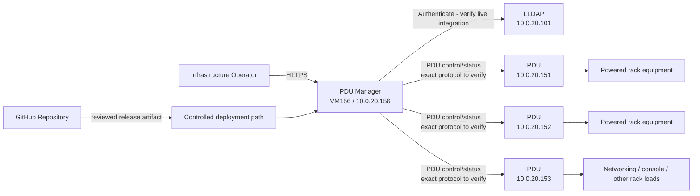
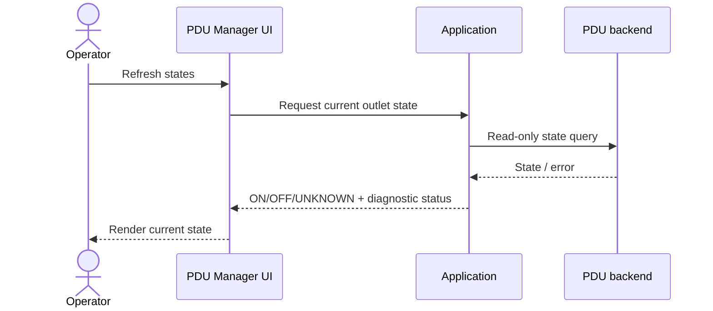
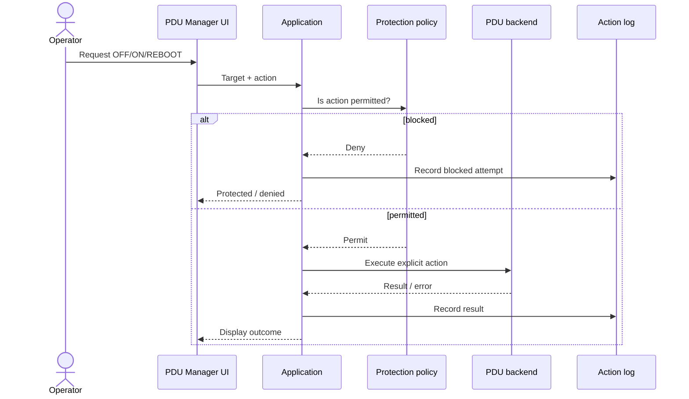
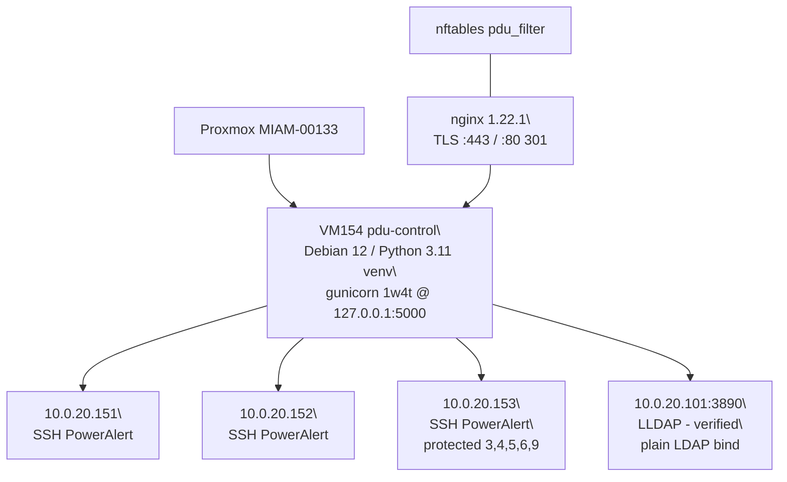

# Architecture

This is the single lean architecture document for the MARION-IA-USA PDU Manager. It follows the arc42 section structure and uses Mermaid for diagrams.

Implementation details not yet captured are explicitly marked **Unknown / verify**. Do not fill those gaps with guesses. (The 2026-09-25 capture came from VM154, now the fallback host; production runs on VM156 since 2026-09-27.)

## 1. Introduction and Goals

### Purpose

The PDU Manager provides a centralized internal web interface for monitoring and deliberately controlling power outlets on network-managed PDUs in the MARION-IA-USA server environment.

The service reduces the operational risk of interacting with raw PDU interfaces and provides human-readable mapping, protection, logging, and a recoverable software change path.

### Requirements Overview

Architecturally significant requirements include:

- `REQ-008` - protect critical outlets;
- `REQ-010` - automated validation must not actuate production hardware;
- `REQ-011` / `REQ-012` - authenticated access and externalized secrets;
- `REQ-015` - code deployment must preserve mutable site configuration;
- `REQ-018` - production HTTPS;
- `REQ-019` - GitHub becomes authoritative application source after parity validation;
- `REQ-020` - clean-environment reproducibility;
- `REQ-022` / `REQ-023` - controlled production deployment and rollback.

See `../REQUIREMENTS.md` for the complete requirement set.

### Quality Goals

1. **Safety:** automated testing/deployment cannot unexpectedly change electrical power state.
2. **Recoverability:** VM154 can be recreated from source, deployment automation, externalized secrets, and backed-up mutable configuration.
3. **Traceability:** production releases map to reviewed Git commits/artifacts.
4. **Operability:** operators can understand device identity, state, action result, and protection status from the browser UI.
5. **Maintainability:** another human/AI agent can continue work from repository-local documentation and code.

### Stakeholders

| Stakeholder / Role | Primary Concern |
|---|---|
| Infrastructure operator | Correct device identity, safe power actions, clear status, rapid recovery |
| Startup Teams engineering | Reproducible source, reviewable changes, tests, maintainable code |
| AI coding/ops agents | Explicit guardrails, discoverable commands, no hidden production state |
| System owner | Avoid accidental outages and preserve operational continuity |

## 2. Architecture Constraints

- Production currently runs on **VM156** hosted by `MIAM-00133` (2026-09-27 cutover; VM154 = powered-off fallback, `onboot=0`).
- Production UI is currently reached at `https://10.0.20.156/` (API root `/api/v1`; VM154 answers nothing while powered off).
- Managed PDU endpoints exist on the private `10.0.20.x` management network, including `10.0.20.151`, `.152`, and `.153`.
- Automated CI/deployment validation must not use real outlet actuation.
- Secrets must not be committed to Git.
- Human approval is required before merge under the current repository governance model.
- Production deployment should restart application services rather than rebooting the production VM (VM156) when a service restart is sufficient.
- The current runtime stack must be captured before selecting a new deployment technology.

## 3. Context and Scope

### Business Context / C4 System Context

### Technical Context

Known interfaces:

| Interface | Direction | Purpose | Status |
|---|---|---|---|
| HTTPS | Operator -> VM154 | Browser UI | Known current deployment |
| PDU management protocol | VM154 -> PDUs | Read state and execute approved power actions | **Unknown / verify exact implementation**; UI has described a direct SSH/PowerAlert backend |
| LDAP/LLDAP | VM154 -> `10.0.20.101` | Authentication | Known environment dependency; **verify exact live implementation** |
| GitHub | Engineering/CI -> repository | Source/change management | Target source of truth |
| Deployment runner | CI/CD -> VM154 | Controlled software release | Target, not yet implemented |

Trust boundary: production PDU credentials and directory credentials must remain outside the repository and should be accessible only to the identities that require them.

## 4. Solution Strategy

### Current strategy

The PDU Manager runs as a single internal web application on VM154 and communicates with the managed PDUs over the management network.

The exact application framework, reverse proxy, process manager, data format, and service unit are **Unknown / verify from live VM154** during source capture.

### Target strategy

- Capture the live service without rewriting it.
- Establish GitHub as the authoritative source after parity validation.
- Separate immutable application code from secrets and mutable site configuration.
- Test PDU behavior through mocks/non-actuating adapters.
- Reproduce the service on a clean staging VM.
- Build immutable release artifacts in CI.
- Deploy the exact staging-tested artifact to VM154 only after human approval.
- Maintain a known-good rollback release.

## 5. Building Block View

The live implementation was captured from VM154 on 2026-09-27 (see `CAPTURE_MANIFEST.md`). All modules below are **Implemented and verified** — they were derived from the running systemd unit and committed to `app/`.

| Building Block | Responsibility | Code Location (repo) | Live path on VM154 |
|---|---|---|---|
| Web UI + legacy API | Login (LLDAP session + emergency-local), dashboard (outlet grid, batch, presets, .md config save/upload), legacy /api routes routed through the action service | `app/app.py` (1,636 lines; HTML/CSS/JS inline via `render_template_string`; 21 routes) | `/opt/pdu-control/app.py` |
| Runtime core | Per-PDU busy locks, worker subprocess, state cache, structured audit, waiting-for-lock queue, protected-recovery-ON, self-host (153:9) pending-marker + startup reconcile | `app/app_runtime.py` | `/opt/pdu-control/app_runtime.py` |
| Action service | Single shared action path: authorization, hard protected-outlet invariant, idempotency (request_id replay, 24h), error model | `app/action_service.py` | `/opt/pdu-control/action_service.py` |
| API v1 blueprint | `/api/v1` health/me/pdus/outlets/actions/batch/jobs/audit; HTTP Basic (LLDAP); rate limit 120 GET / 20 POST per minute per identity | `app/api_v1.py` | `/opt/pdu-control/api_v1.py` |
| Authentication integration | LLDAP bind-check (`uid=<user>,ou=people,dc=example,dc=com` @ 10.0.20.101:3890, plain LDAP), `member=` group search (60s TTL cache), Actor role model | `app/auth_lldap.py` | `/opt/pdu-control/auth_lldap.py` |
| PDU adapter | pexpect SSH → PowerAlert menu driver (port 22, legacy algos ssh-rsa/CBC); `1 Devices → 5 Loads → 1 Configuration → outlet`; ON/OFF menu 3 + `y`; REBOOT/CYCLE menu 4 native Cycle Load; verify via fresh session | `app/pdu_ssh_direct.py` | `/opt/pdu-control/pdu_ssh_direct.py` |
| Worker CLI | App-spawned subprocess wrapper around the driver (`pdu_worker.py <ip> <outlet> <action>`) | `app/pdu_worker.py` | `/opt/pdu-control/pdu_worker.py` |
| Legacy monolith | Pre-V3 monolith, **not imported** by the live app; kept for archaeology | `app/legacy_app_direct.py` | `/opt/pdu-control/app_direct.py` |
| Configuration | JSON: 3 PDUs (asset_id, ip, mac, labels, protected), control_host, vm block | `config/examples/config.example.json` | `/etc/pdu-control/config.json` (640 root:pducontrol) |
| Secrets | 9 B64 vars (PDU_USER/PASS, SNMP_VERSION/RO/RW — SNMP unused by live code, WEB_USER/PASS, LDAP_SERVICE_USER/PASS) | `deploy/examples/secrets.env.example` (placeholders) | `/etc/pdu-control/secrets.env` (640 root:pducontrol) |
| Action log | `audit.log` (key=value) + `audit.log.jsonl` (structured); no rotation configured | — (state, not in Git) | `/var/log/pdu-control/` |
| Idempotency store | request_id → job_ids map, 24h retention | — (state, not in Git) | `/var/lib/pdu-control/idempotency.json` |
| TLS termination | nginx site: :80 → 301 :443; :443 → 127.0.0.1:5000; TLSv1.2/1.3 | `deploy/proxy/nginx-pdu-control.conf` | `/etc/nginx/sites-available/pdu-control` |
| Firewall | nftables `inet pdu_filter`: allow 22/80/443 from 10.0.20.0/24 + 10.0.10.0/24; drop 80/443 otherwise | `deploy/nftables.conf` | `/etc/nftables.conf` |
| Service unit | systemd simple service, user pducontrol, Restart=always/5s, logs → journald | `deploy/systemd/pdu-control.service` | `/etc/systemd/system/pdu-control.service` |
| Historical bootstrap | V1-era installer (writes config + venv + old unit binding 0.0.0.0:5000); provenance only, NOT the current install method | `deploy/scripts/pdu-control-bootstrap.sh` | `/root/pdu-control-bootstrap.sh` |

## 6. Runtime View

### Read-only state refresh

A state refresh must never imply a power action.

### Protected power action

Automated tests exercise this flow against a mock backend, not real PDUs.

## 7. Deployment View

### Current deployment

**Captured facts (2026-09-27, verified from live runtime):**

- VM154 `pdu-control`: Debian 12 bookworm, kernel 6.1.0-53-cloud-amd64, 1 vCPU-class (2 assigned), 1 GiB RAM, 16 GiB disk, qemu-guest-agent active, timezone America/Chicago.
- Service: systemd `pdu-control.service` (enabled, `Restart=always`, `RestartSec=5`, `User=pducontrol`, `WorkingDirectory=/opt/pdu-control`, logs to journald). ExecStart: `/opt/pdu-control/venv/bin/gunicorn --workers 1 --threads 4 --bind 127.0.0.1:5000 --timeout 120 --access-logfile - --error-logfile - app:app`.
- Reverse proxy: nginx 1.22.1, site `/etc/nginx/sites-available/pdu-control`; TLS self-signed cert at `/etc/nginx/ssl/pdu-control.{crt,key}` (CN=10.0.20.156, SAN IP+DNS:pdu-control, valid 2026-09-11 → 2031-09-10, sha256 fingerprint `137308d592260184fd75b7a555e27f61332a8c7ffe5feb1f58d1c5553b2221a9`).
- Firewall: nftables `inet pdu_filter` (enabled): SSH 22 + web 80/443 allowed from 10.0.20.0/24 and 10.0.10.0/24 only; 80/443 dropped otherwise.
- App data: config `/etc/pdu-control/config.json` (640 root:pducontrol), secrets `/etc/pdu-control/secrets.env` (640 root:pducontrol, 9 B64 vars), audit `/var/log/pdu-control/audit.log{,.jsonl}`, idempotency `/var/lib/pdu-control/idempotency.json`, pending-reboot marker `/var/lib/pdu-control/pending_reboot.json`.
- Auth: LLDAP at 10.0.20.101:3890 (plain LDAP, no TLS, base `dc=example,dc=com`); UI session auth (12h, HttpOnly, SameSite=Lax; Secure when `PDU_SECURE_COOKIES=1`) with emergency-local root fallback (web only, == pdu-admin); `/api/v1` HTTP Basic with LLDAP credentials; groups `pdu-viewer/pdu-operator/pdu-admin/pdu-ai-agent/pdu-ai-admin-override`.
- Power backend: direct SSH to PDU :22 as user from `PDU_USER_B64`, PowerAlert menu navigation via pexpect; ON/OFF = menu 3 + `y`; REBOOT/CYCLE = menu 4 native Cycle Load (atomic, PDU-committed); every action verified through a fresh SSH session; per-PDU busy lock + 60 s command timeout; batch cap 72 outlets.
- Protection: `MIAM-00153` outlets 3,4,5,6,9 protected (firewall, 2.5G, 10G, 1G switch, control host MIAM-00133). Protected OFF forbidden for EVERYONE (no override path exists in code). Protected REBOOT requires pdu-admin override + non-empty reason + `acknowledge_protected_device` (+ `acknowledge_controller_may_go_offline` for self-host 153:9). Unexpected OFF after protected cycle → recovery ON (2 attempts). Batch actions respect protection (all-or-nothing pre-dispatch checks).
- An external monitor at `10.0.20.172` (services.miam.home.arpa) polls `/` + `/login` every ~5 min with python-requests — a downstream availability consumer exists.

Exact OS/runtime/service/proxy/persistent paths **captured and verified** — see `CAPTURE_MANIFEST.md` and `docs/OPERATIONS.md` for exact commands.

### Target deployment

```mermaid
flowchart LR
    Repo[GitHub main] --> CI[CI build/test/scan]
    CI --> Artifact[Immutable release artifact]
    Artifact --> Stage[Staging VM\nnon-actuating backend]
    Stage --> Gate[Human production approval]
    Gate --> Runner[Least-privilege internal deployment runner]
    Runner --> Prod[VM154]
    Prod --> Health[Read-only health checks]
    Health -->|failure| Rollback[Previous known-good release]
```

Runner placement and exact packaging method require an approved architecture decision after the live stack is known.

## 8. Cross-Cutting Concepts

### Authentication / authorization

**Verified live:** UI uses session login backed by LLDAP bind-check (`uid=<user>,ou=people,dc=example,dc=com` at `10.0.20.101:3890`, plain LDAP) plus an emergency-local root fallback (web UI only, treated as pdu-admin, audited with `auth_source=emergency-local`). `/api/v1` uses HTTP Basic with LLDAP credentials only (no local-root Basic). Authorization roles derive from LLDAP groups via `member=<userDN>` search (LLDAP has no memberOf): `pdu-viewer` (view), `pdu-operator` (control normal), `pdu-admin` (override protected reboot + administer), `pdu-ai-agent` + `pdu-ai-admin-override` (agent override path). Group results cache 60 s (revocation lands within TTL). Automated tests must not bypass safety controls; the hard protected-OFF invariant has no bypass flag at all.

### Secrets

PDU credentials, LDAP bind passwords, session secrets, TLS private keys, and deployment credentials must remain outside Git. **Verified live model:** all credentials live in `/etc/pdu-control/secrets.env` (9 vars, base64-encoded, 640 root:pducontrol); the Flask session signing key is derived from the emergency credentials (`pdu-control-v3:{WEB_USER}:{WEB_PASS}` SHA-256), so rotating the emergency password rotates session signing; SNMP_* values are loaded but unused by the live modules (legacy compatibility). Repository side: `deploy/examples/secrets.env.example` holds placeholder names only.

### Safety

Power actuation is a consequential operation. Protection/lockout logic is a first-class application concern and must be tested independently of real hardware.

### Configuration

Mutable production configuration must survive application upgrades and rollbacks. **Verified live:** mutable site configuration is `/etc/pdu-control/config.json`, stored OUTSIDE the application tree (`/opt/pdu-control`) — code releases cannot silently overwrite it. The UI's `.md` save/upload feature exports/imports batch selections (schema v1: `<!-- PDU_BATCH_ACTION=... -->` + `<!-- PDU_BATCH_ITEM=order|ip|outlet -->` machine-readable comments); upload validates structure and rejects protected outlets for OFF/REBOOT at upload time and never auto-executes.

KVM-related naming: **reconciled to the authoritative mapping on 2026-09-27 (FW-001, from the 2026-09-17 server-architecture spreadsheet via Future Work v2):** `MIAM-00172 - JetKVM Hardware Console` (outlet 153:12) and `MIAM-00182 - TESmart 16-Port HDMI KVM Switch` (outlet 153:24). Before this reconciliation the live VM154 config (rev 2026-09-06) used `MIAM-00172 - JetKVM` and `MIAM-00173 - KYY 1080p monitor / JetKVM / KVM HDMI splitter`; those are now superseded. From FW-002 onward the GitHub repository is the mapping source of truth; a newer spreadsheet from Jordan triggers a reviewed Git update, never an unmanaged production edit.

### Logging

**Verified live:** dual audit log at `/var/log/pdu-control/`: `audit.log` (human-readable key=value lines) and `audit.log.jsonl` (structured JSON). Records include ts, actor, source (ui/api/system), pdu/outlet/asset, action, override flag, reason, request_id, and outcome (`ACCEPTED` pre-transmission, then `SENT`/`SUCCESS` with `verified_state`, or `FAILED` with error). Login attempts are audited (success/failure/rejected-no-group). Backend errors surface with diagnostics. No log rotation is configured (technical debt — see CURRENT_STATE_AND_LIMITATIONS).

### Testing

Current implemented test layers (in repo):

- `tests/test_capture.py` — 10 tests: module import integrity, protected-OFF hard invariant (including emergency-root bypass attempt), protected-reboot override ack chain, self-host outlet metadata, `.md` config roundtrip, upload protected rejection, action normalization. All run against fixtures with redirected paths; **no network, no SSH, no actuation**.
- `tests/repro_app_test.py` — Flask test-client boot: health/login/auth-gates.

Future layers (target): mock PDU adapter tests, staging deployment tests, production read-only health checks.

## 9. Architecture Decisions

- [ADR-0001 - Use Markdown and Mermaid for architecture documentation](adr/0001-use-markdown-and-mermaid-for-architecture-documentation.md)
- [ADR-0002 - GitHub source of truth with VM154 as the production target](adr/0002-github-source-of-truth-and-vm154-production.md)
- A future ADR is required for self-hosted runner placement and the exact immutable deployment mechanism after the live stack is captured.

## 10. Quality Requirements

| Requirement | Quality Attribute | Target / Scenario | Verification |
|---|---|---|---|
| `REQ-008` | Safety | Critical outlets cannot be casually OFF/REBOOTed | Mock policy tests + config inspection |
| `REQ-010` | Safety | CI/deploy checks perform no real actuation | Workflow/script review + tests |
| `REQ-020` | Recoverability | Clean staging VM can host the service from repo | Clean deployment test |
| `REQ-021` | Maintainability | PR checks automatically validate source | CI workflow run |
| `REQ-022` | Release integrity | Production receives exact staging-tested artifact | Release manifest/SHA check |
| `REQ-023` | Recoverability | Failed release can return to prior known-good version | Staging rollback test |
| `REQ-024` | Operability | Another agent can continue from repo-local context | Handoff/review exercise |

## 11. Risks and Technical Debt

### Risks

| Risk | Impact | Mitigation / Next Step |
|---|---|---|
| ~~Live code path is not yet formally captured~~ | ~~Wrong historical copy could be committed~~ | **RESOLVED 2026-09-27** — captured from running systemd unit; see CAPTURE_MANIFEST.md |
| ~~Secrets may be embedded in live files~~ | ~~Credential disclosure in Git~~ | **RESOLVED** — secrets live in external secrets.env (B64); capture scan clean; 1 doc credential redacted |
| CI could accidentally contact real hardware with privileged credentials | Outage | Mock/non-actuating backend; no production actuation credentials in PR CI (tests run with redirected paths, no network) |
| ~~Mutable config may be stored inside app tree~~ | ~~Deploy could overwrite outlet mapping/protection~~ | **RESOLVED** — live config at /etc/pdu-control, outside /opt/pdu-control app tree |
| Runtime dependencies exist only as venv state on VM | Rebuild failure | requirements.txt reconstructed from live freeze; validate on clean staging VM (TDR-0001 remains open) |
| Direct root/self-hosted runner on hypervisor would expand trust boundary | Cluster compromise risk | Dedicated least-privilege runner; human-approved ADR |
| Audit log has no rotation | Disk growth on 16G VM | Add logrotate config in a future PR |
| External monitor (10.0.20.172) depends on unauthenticated UI endpoints | Unavailable monitor after auth changes | Keep /login + /health reachable; coordinate before locking down |

### Technical Debt

- [TDR-0001 - Production VM is not yet reproducible from GitHub](tdr/0001-production-vm-not-yet-reproducible-from-github.md) — app-level repro PROVEN (tests + Flask test client); full-VM staging repro still open.
- Audit log rotation missing (discovered 2026-09-27).
- `app_direct.py` legacy monolith retained (not imported); candidate for removal after parity sign-off.
- SNMP_* secrets loaded but unused by live modules; cleanup candidate.

## 12. Glossary

| Term | Definition |
|---|---|
| PDU | Network-managed Power Distribution Unit controlling electrical outlets |
| VM154 | Current production virtual machine hosting the PDU Manager |
| MIAM-00133 | Proxmox host currently running VM154 |
| JetKVM | Hardware console endpoint represented by `MIAM-00172` |
| TESmart KVM | 16-port HDMI KVM represented by `MIAM-00182` |
| Actuation | A command that changes outlet power state, such as ON/OFF/REBOOT/CYCLE |
| Read-only health check | Validation that observes application/backend state without changing PDU state |
| Release artifact | Immutable package built from a specific Git commit and promoted through staging/production |
